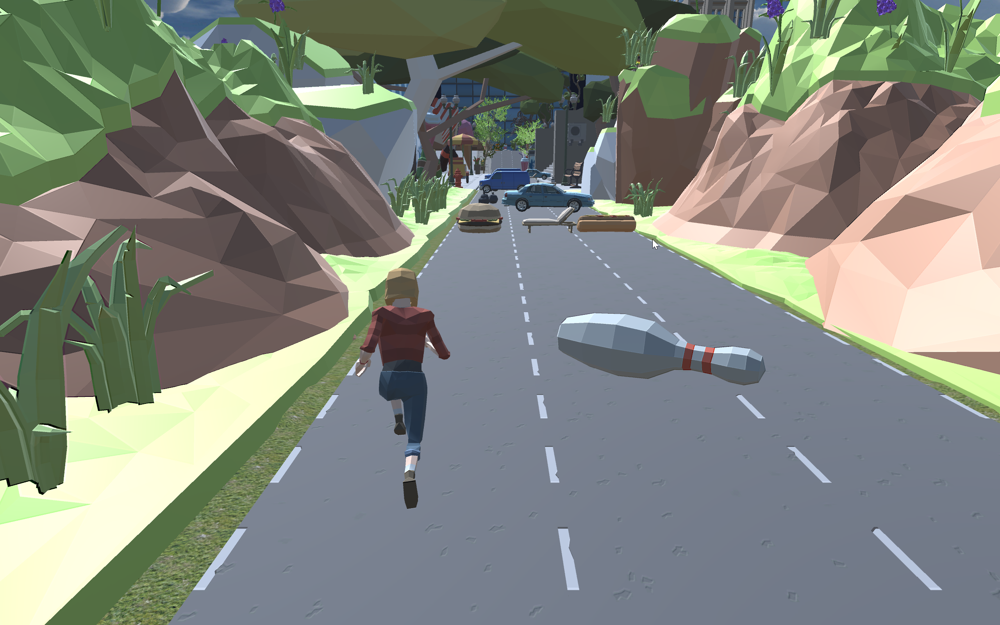
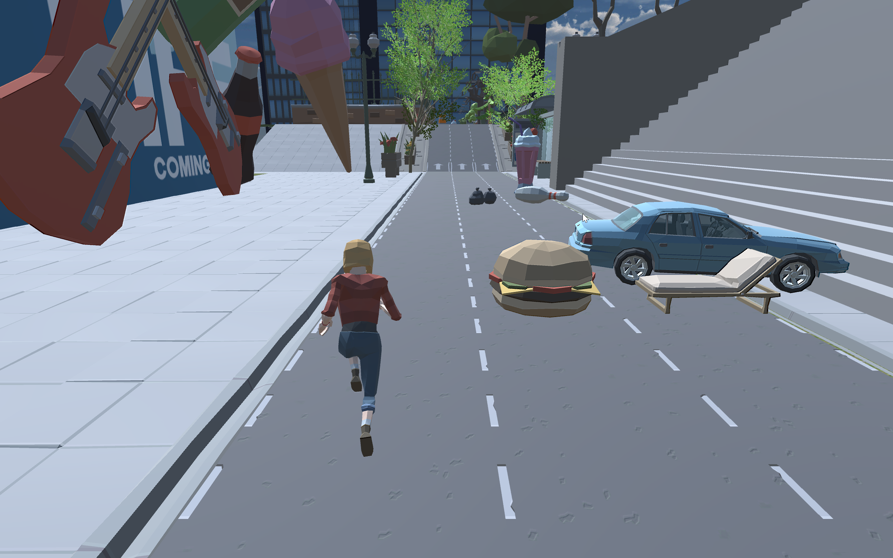
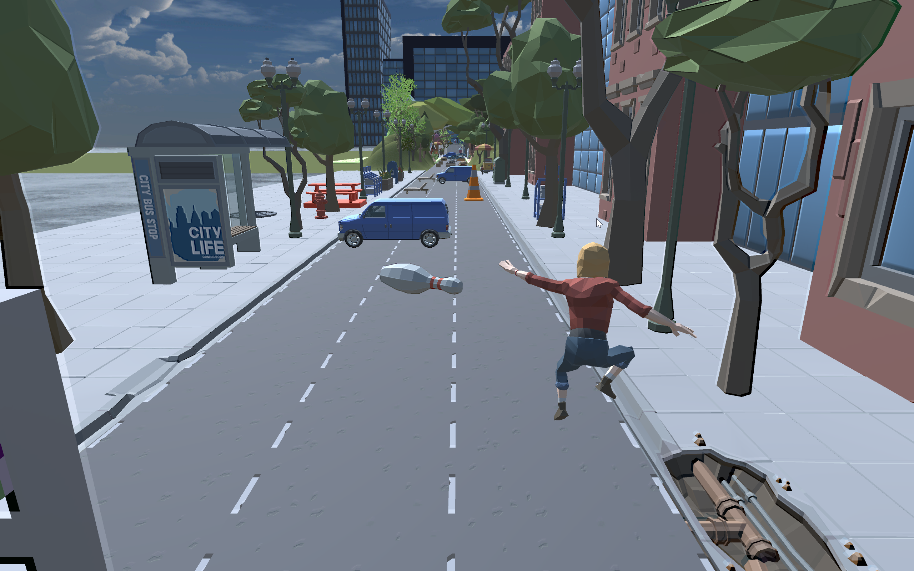
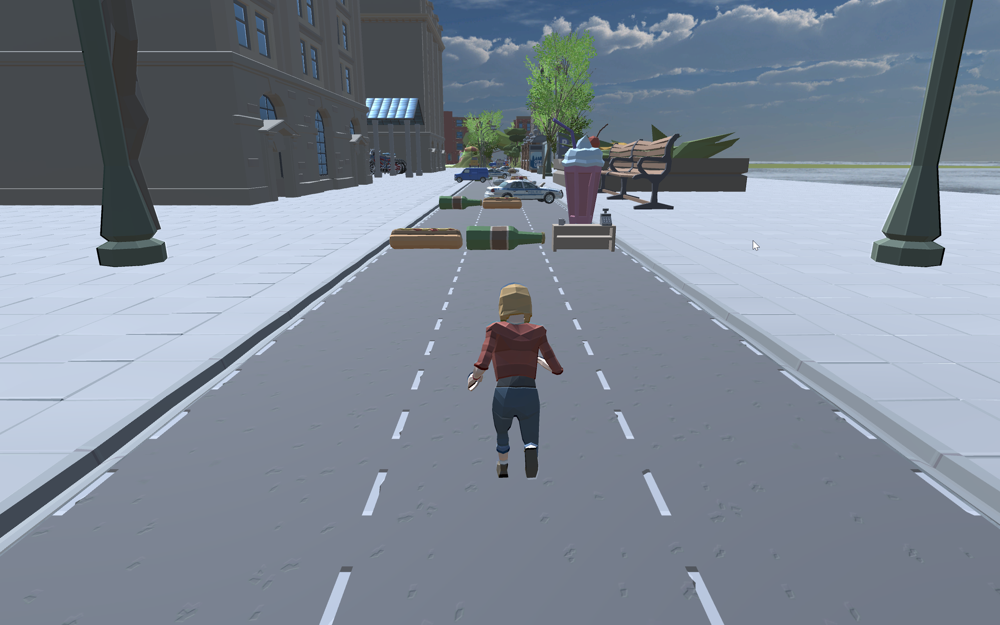

# 大工跑酷

## 介绍

跑酷游戏操作简便，易于上手，兼顾休闲性与挑战性，曾风靡一时。本游戏采用传统3D类跑酷游戏操作与机制，在地图上加入一些大工特色建筑，成为独特的“大工跑酷”

## 开发环境
在Unity2020.3.25f1c1下调试运行

## 项目组成
1.游戏场景及障碍物，主要用外部导入的资源包构建
2.UI场景
3.C#脚本负责处理游戏物体逻辑，与UI面板的调用控制
## 在Unity上运行

在Unity上执行新建-打开项目，选择项目文件夹

在Unity项目面板中打开**Assets/scenes/MainMenu.unity**。

单机播放按钮，开始运行游戏

## 玩法

**W**键跳跃

**S**键翻滚

**A/D**键左右切换道路

## 游戏特色

1. 地图无限延申

2. 场景顺序随机

3. 难度随时间增大

4. 奇奇怪怪的障碍物

5. 感受窝工绝美风景与独特建筑

   

   

## 项目负责人
@StarsDriver

## 开源协议
[MIT](https://github.com/Drdr00m/DUTparkour/blob/main/LICENSE)
